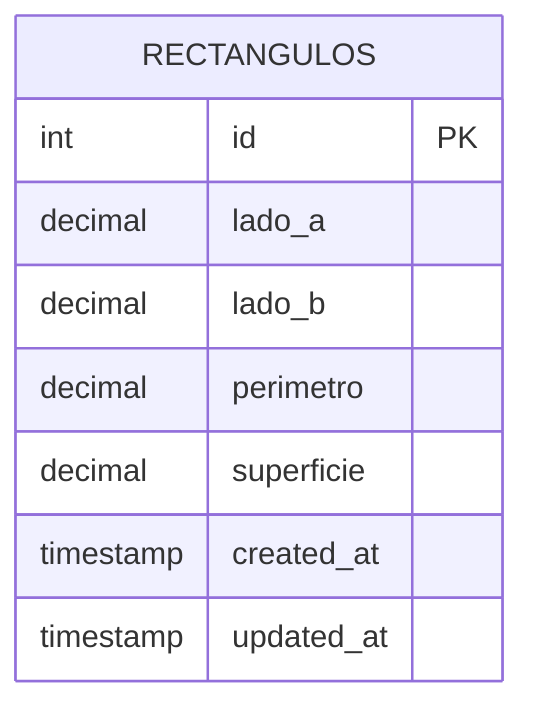

# Diagrama de entidades

```mermaid
erDiagram
    RECTANGULOS {
        int id PK
        decimal lado_a
        decimal lado_b
        decimal perimetro
        decimal superficie
        timestamp created_at
        timestamp updated_at
    }
```