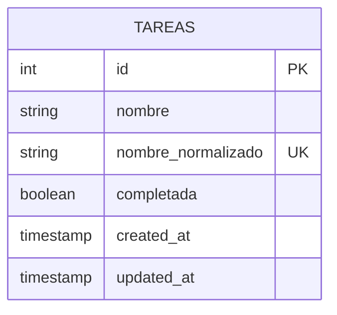

# Diagrama de entidades

```mermaid
erDiagram
    TAREAS {
        int id PK
        string nombre
        string nombre_normalizado UK
        boolean completada
        timestamp created_at
        timestamp updated_at
    }
```