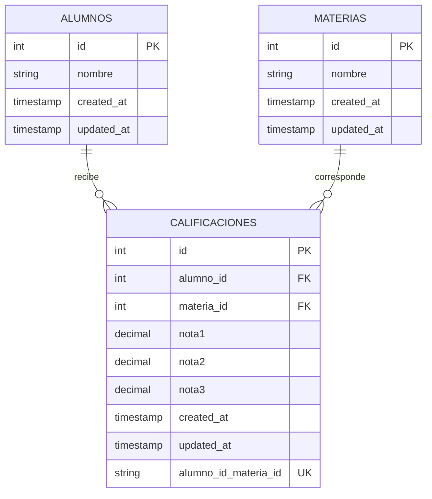

# Diagrama de entidades

```mermaid
erDiagram
    ALUMNOS ||--o{ CALIFICACIONES : recibe
    MATERIAS ||--o{ CALIFICACIONES : corresponde

    ALUMNOS {
        int id PK
        string nombre
        timestamp created_at
        timestamp updated_at
    }

    MATERIAS {
        int id PK
        string nombre
        timestamp created_at
        timestamp updated_at
    }

    CALIFICACIONES {
        int id PK
        int alumno_id FK
        int materia_id FK
        decimal nota1
        decimal nota2
        decimal nota3
        timestamp created_at
        timestamp updated_at
        string alumno_id_materia_id UK
    }
```